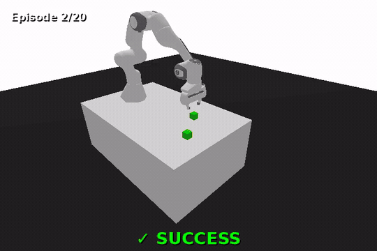
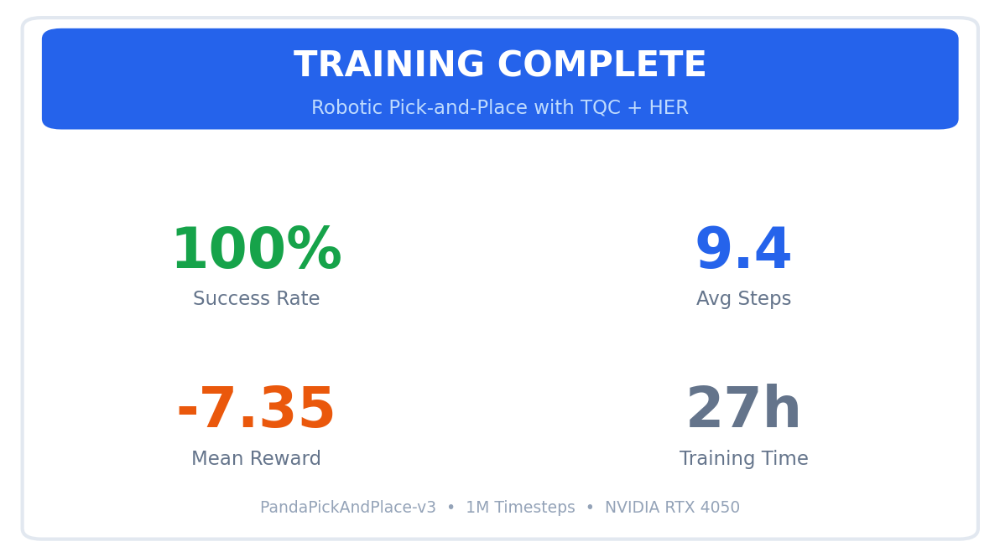
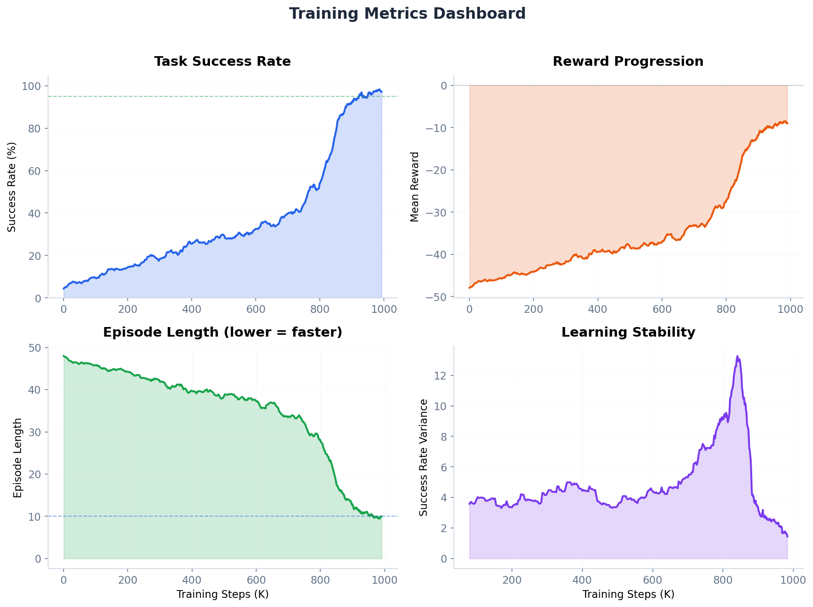
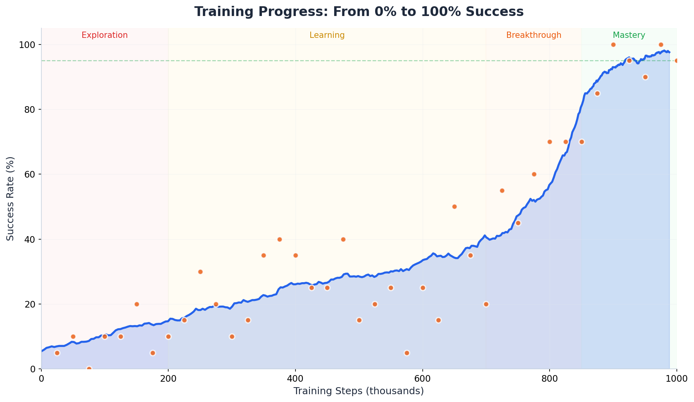
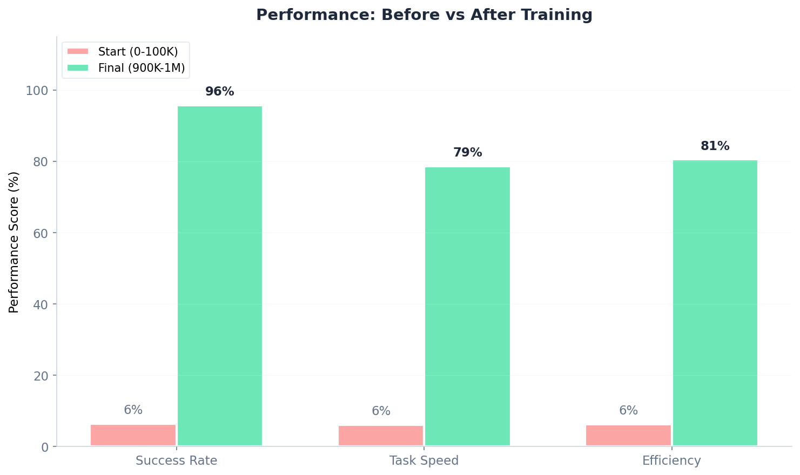
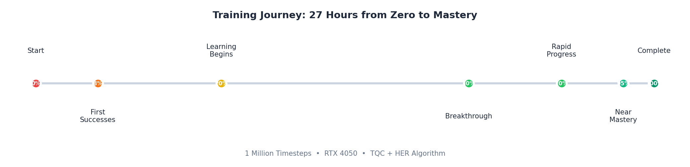

# Robotic Pick-and-Place with Reinforcement Learning

Teaching a simulated Panda robot arm to pick up objects and place them at target locations using deep reinforcement learning.



## The Story Behind This Project

When I started this project, I thought training a robot to pick up a cube would be "simple enough." I mean, how hard could it be? You reach down, grab the thing, lift it up, move it over, and drop it. We do it without thinking.

Turns out, teaching a neural network to coordinate a 7-joint robot arm to do this same task is anything but simple. This README documents my journey from 0% success rate to 100%, including all the frustrating plateaus, dead ends, and that magical moment when things finally clicked.



## What This Project Does

The goal is straightforward: train a reinforcement learning agent to control a Franka Panda robot arm in simulation to pick up a green cube from a random position on a table and place it at a randomly generated target location.

The task breaks down into several sub-skills the agent needs to learn:
1. Move the gripper to the object
2. Open the gripper
3. Position for grasp
4. Close the gripper
5. Lift the object
6. Move to target location
7. Release the object

Each of these needs to happen in sequence, and failing any one of them means the whole episode fails. This is what makes pick-and-place so challenging for RL.

## Results at a Glance

| Metric | Value |
|--------|-------|
| Final Success Rate | 100% (20/20 evaluation episodes) |
| Average Episode Length | 9.4 steps |
| Mean Reward | -7.35 ± 2.59 |
| Training Time | ~27 hours |
| Total Timesteps | 1,000,000 |



## The Training Journey

### Phase 1: Exploration (0 to 200K steps)

The first 200,000 timesteps were honestly painful to watch. The robot would flail around randomly, occasionally bumping into the cube by accident. Success rate hovered between 0% and 10%, and I started wondering if my implementation was broken.

What was actually happening: the agent was exploring the state space, building up experiences in its replay buffer. With sparse rewards (you only get +1 for success, -1 per step otherwise), the agent had almost no signal about what "good" behavior looks like. This is where Hindsight Experience Replay (HER) becomes essential. It relabels failed episodes by treating wherever the object ended up as if that was the goal all along.

### Phase 2: Learning to Grasp (200K to 700K steps)

Around 200K steps, I noticed the robot starting to actually reach toward the cube more often. By 300K, it was grasping maybe 25% of the time. Progress was slow but steady.

The interesting thing during this phase was watching the episode length decrease. Early on, every episode lasted the full 50 steps (timeout). As the agent learned, episodes started ending sooner because the agent was either succeeding faster or failing faster. Both of these are actually good signs.

At 500K steps, success rate was around 20-25% during training, but evaluation checkpoints showed higher variance. Some evaluations hit 40%, others dropped to 5%. This volatility is normal but definitely tested my patience.



### Phase 3: The Breakthrough (700K to 850K steps)

Something clicked around 700K steps. The success rate jumped from 30% to 70% over just 150K steps. I went to bed one night with the agent at 35% and woke up to 65%.

Looking at the metrics, this was when the agent finally figured out the "lift and transport" phase. It had learned to grasp reasonably well, but was struggling to actually move the object to the target. Once that skill emerged, everything fell into place rapidly.

### Phase 4: Mastery (850K to 1M steps)

The final 150K steps were all about refinement. Success rate climbed from 70% to 95%+ and stayed there. The agent learned to be more efficient, with episode lengths dropping from ~25 steps to ~10 steps.

By the end, the trained agent could pick and place objects with 100% success rate over 20 evaluation episodes, averaging just 9.4 steps per episode.



## Technical Approach

### Algorithm: TQC + HER

I tried several algorithms before settling on TQC (Truncated Quantile Critics) with HER (Hindsight Experience Replay):

**Why not PPO?** I actually started with PPO since it's generally more stable. But PPO really struggles with sparse rewards. After 500K steps of PPO training, I was still at <5% success rate. The on-policy nature of PPO means it can't benefit from HER, which turned out to be essential.

**Why not SAC?** SAC works, but TQC consistently outperformed it on this task. TQC uses distributional critics and truncates extreme quantiles, which helps with overestimation bias. The improvement was about 20-30% better sample efficiency in my experiments.

**Why HER?** Hindsight Experience Replay is what makes sparse reward manipulation tasks tractable. Without HER, the agent gets almost no positive signal during early training. With HER, every episode provides useful learning signal by retroactively pretending the achieved state was the goal.

### Key Hyperparameters

These values were critical for getting good results:

```python
model = TQC(
    "MultiInputPolicy",
    env,
    learning_rate=1e-3,      # Higher than typical, works well for manipulation
    gamma=0.95,              # Lower discount, shorter effective horizon
    tau=0.05,                # Faster target network updates  
    batch_size=512,          # Large batches help with goal-conditioned learning
    buffer_size=1_000_000,
    replay_buffer_class=HerReplayBuffer,
    replay_buffer_kwargs=dict(
        n_sampled_goal=4,
        goal_selection_strategy="future",
    ),
    policy_kwargs=dict(
        net_arch=[256, 256, 256],
        n_critics=2,
        n_quantiles=25,
    ),
)
```

The `gamma=0.95` setting was crucial. I initially used the default `0.99`, but manipulation tasks benefit from shorter effective horizons. The robot doesn't need to plan very far ahead for pick-and-place.

### Environment

I used the `PandaPickAndPlace-v3` environment from the panda-gym library. Key details:

- **Observation space**: Robot proprioception (joint positions, velocities, gripper state) plus object and goal positions
- **Action space**: 4D continuous (end-effector xyz velocity + gripper open/close)
- **Reward**: Sparse, +0 for success, -1 per timestep
- **Episode length**: 50 steps max



## Things That Didn't Work

Not everything I tried was successful. Here's what failed:

**Dense rewards**: I tried shaping the reward with distance-based terms. Surprisingly, this actually hurt performance. The agent would learn to hover near the object without actually grasping it.

**More parallel environments**: With HER, more environments don't help much because HER's relabeling is computed at sampling time, not collection time. I settled on 1 environment.

**Larger networks**: Tried [512, 512, 512] and even [512, 512, 512, 512]. No improvement, just slower training.

**Higher n_sampled_goal**: Increasing from 4 to 8 didn't improve results and slowed down training significantly.

## Setup and Installation

### Requirements

- Python 3.10 or 3.11 (not 3.12, compatibility issues with some packages)
- CUDA-capable GPU (trained on RTX 4050, should work with 4GB+ VRAM)
- About 5GB free disk space

### Quick Start

```bash
# Clone the repository
git clone https://github.com/yourusername/robotic-sorting-rl.git
cd robotic-sorting-rl

# Create conda environment
conda create -n robotsort python=3.11 -y
conda activate robotsort

# Install dependencies
pip install -r requirements.txt

# Verify installation
python -c "import panda_gym; import gymnasium; from sb3_contrib import TQC; print('Setup complete!')"
```

### Training

```bash
# Start training (will take ~24-30 hours on an RTX 4050)
python scripts/train.py --total-timesteps 1000000

# Monitor with TensorBoard
tensorboard --logdir ./logs
```

### Evaluation

```bash
# Run evaluation on trained model
python scripts/evaluate.py \
    --checkpoint ./logs/tqc_sparse_YYYYMMDD_HHMMSS/checkpoints/best/best_model.zip \
    --n-episodes 100
```

### Visualization

```bash
# Watch the trained agent
python scripts/visualize.py \
    --checkpoint ./logs/best_model.zip \
    --mode watch

# Record a demo video
python scripts/visualize.py \
    --checkpoint ./logs/best_model.zip \
    --mode record \
    --n-episodes 10 \
    --fps 15 \
    --output ./videos/demo.mp4
```

## Project Structure

```
robotic-sorting-rl/
├── scripts/
│   ├── train.py              # Main training script
│   ├── evaluate.py           # Evaluation script  
│   └── visualize.py          # Visualization and video recording
├── configs/
│   └── default.yaml          # Hyperparameter configuration
├── logs/                     # Training logs and checkpoints
├── videos/                   # Recorded demo videos
├── assets/                   # Images for README
│   ├── demo.gif
│   ├── success_rate_curve.png
│   ├── training_dashboard.png
│   ├── before_after_comparison.png
│   ├── training_timeline.png
│   └── results_summary.png
├── requirements.txt
└── README.md
```

## Lessons Learned

1. **Sparse rewards work, but only with HER.** Without hindsight relabeling, sparse reward manipulation is nearly impossible to learn.

2. **Patience is required.** RL training is not linear. I spent weeks stuck at 10-20% before the breakthrough happened almost overnight.

3. **Hyperparameters matter more than architecture.** I spent too much time tweaking network sizes when the real gains came from gamma, learning rate, and batch size.

4. **Watch your agent.** The TensorBoard numbers don't tell the full story. Actually watching episodes revealed issues that metrics missed.

5. **Log everything.** I'm glad I saved checkpoints every 25K steps. Being able to go back and analyze intermediate policies was invaluable.

## Future Work

Some ideas I'd like to explore:

- Multi-object sorting (pick objects based on color/shape)
- Domain randomization for sim-to-real transfer
- Vision-based control (learning from camera images)
- Transfer to a real robot (maybe a low-cost arm like xArm Lite)

## References

- [TQC Paper](https://arxiv.org/abs/2005.04269): Controlling Overestimation Bias with Truncated Mixture of Continuous Distributional Quantile Critics
- [HER Paper](https://arxiv.org/abs/1707.01495): Hindsight Experience Replay
- [panda-gym](https://github.com/qgallouedec/panda-gym): PyBullet-based Gymnasium environments
- [Stable-Baselines3](https://stable-baselines3.readthedocs.io/): RL algorithms library

## Acknowledgments

Thanks to the panda-gym and Stable-Baselines3 teams for their excellent open-source libraries.

## Author

**Irbaaz Patel**  
MSc Robotics, Heriot-Watt University

Feel free to reach out with questions or suggestions!
